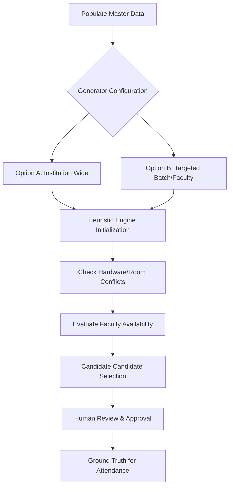
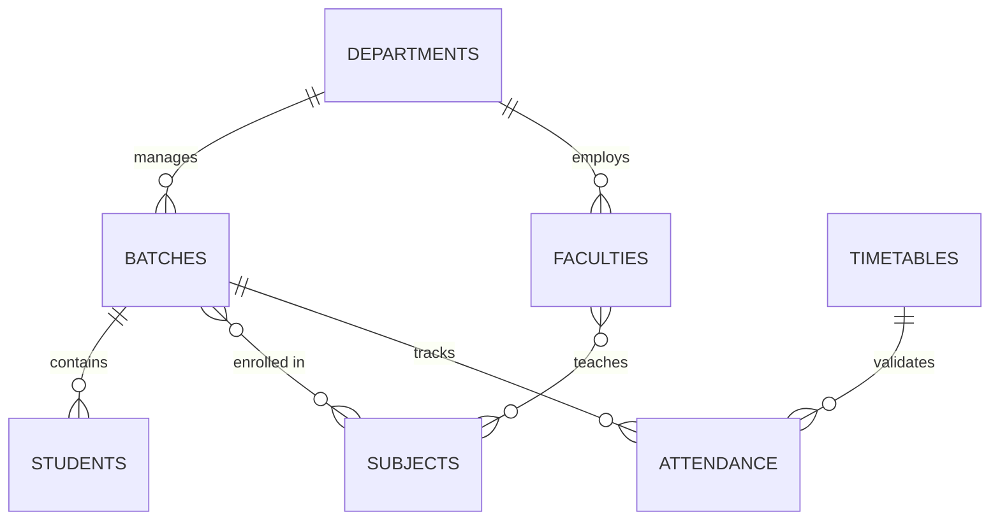

# 🏫 SmartClass: Institutional Scheduling & Attendance Matrix

[](https://github.com/AndyDev94/Smart-Classroom-Web-Portal)
[](https://smartclassroom2026.vercel.app/)

An advanced, production-grade administrative platform designed for public and private Higher Education institutions. This system automates the traditionally manual and error-prone process of institution-wide scheduling through complex heuristic constraints, real-time hardware scanning, and cloud-synchronized attendance tracking.

---

## 🏛 Institutional Vision
*Created for the Jharkhand Seminar Evaluation Project - Government of Jharkhand.*

The **SmartClass Administration Portal** represents a leap toward the "Digital Campus" initiative. By centralizing scheduling intelligence and hardware-secured attendance, the platform eliminates resource wastage, resolves faculty-batch conflicts, and provides administrators with transparent, live academic analytics.

---

## 🧠 System Architecture

### 1. The Heuristic Engine (Brain)
The core of the system is a randomized heuristic constraint-satisfaction solver. It evaluates millions of potential schedule permutations to find the optimal "Clash-Free" outcome based on:
- **Global Conflicts:** Faculty double-booking and Batch overlaps.
- **Physical Constraints:** Matching student counts to Classroom Capacity.
- **Pedagogical Balance:** Distributing subject load evenly across the week.
- **Historical Respect:** Locking resources currently used in previously "Approved" schedules.

#### Logic Flow:


### 2. Database Intelligence (Supabase Schema)
The platform leverages a relational PostgreSQL backbone with real-time listeners.



---

## 🚀 Technical Stack
- **Frontend:** React 18+ (SPA with Client-Side Routing).
- **Tooling:** Vite 6.0 (Build Engine) + Vercel (Cloud Hosting).
- **Database:** Supabase (Cloud PostgreSQL).
- **UX/UI:** Custom Glassmorphic Design System (No generic Tailwind).
- **Scanning Engine:** WebRTC + Keystroke Interception (for USB Laser Scanners).

---

## 🖨️ Reporting & Professional Export
The platform features a high-fidelity **Print Theme** that automatically converts the UI into an ink-friendly, high-contrast document:
- **Timetables:** Auto-forced **Landscape** orientation for wide session grids.
- **Attendance Ledgers:** Auto-forced **Portrait** orientation for multi-page performance reports.
- **SPA Stability:** Custom `vercel.json` routing configuration ensures deep links and refreshes work flawlessly in production.

---

## 🛠 Installation & Secure Setup

### Prerequisites
- Node.js (v18+)
- A Supabase Instance

### Environment Initialization
Create a `.env` file in the root directory:
```env
VITE_SUPABASE_URL=your_project_url
VITE_SUPABASE_ANON_KEY=your_anon_key
```

### Build & Deploy
```bash
npm install
npm run build
# Deploy 'dist' folder to Vercel
```

---

## 📖 Modern Administrative Workflow

1.  **Define Master Objects:** Input Departments, Subjects, Faculties, and verify link integrity.
2.  **Run Generation:** Use the Scheduling Engine to compute clash-free candidates.
3.  **Live Monitor:** Use the Dashboard to track classroom occupancy in real-time.
4.  **Hardware Attendance:** Use either the integrated WebRTC camera or a plug-and-play USB Barcode Scanner to track student presence during slots.
5.  **Performance Analytics:** Review the Attendance Analytics ledger to identify student absenteeism trends.

---

## 📁 Repository Links
- **Public Mirror:** [AndyDev94/Smart-Classroom-Web-Portal](https://github.com/AndyDev94/Smart-Classroom-Web-Portal)
- **Live Deployment:** [smartclassroom2026.vercel.app](https://smartclassroom2026.vercel.app/)

---
*Developed with excellence for the Higher Education digital transformation project.*
